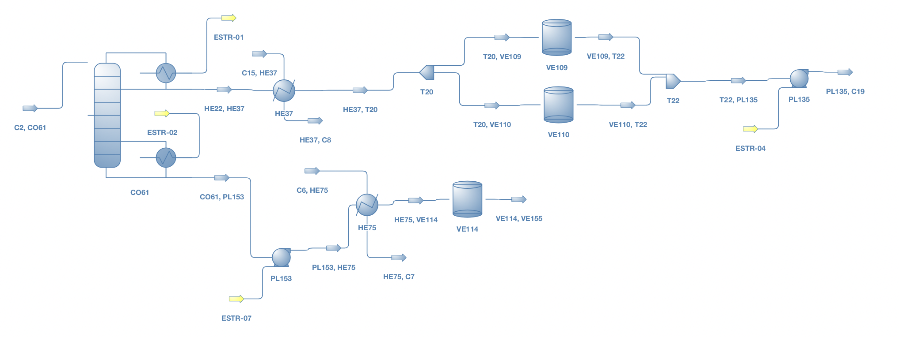

# preHAZOP
Automated Safety Assesments in an early development Stage based on standardized DEXPI P&IDs [^1] and DWSIM process simulation exports [^2].

## Authors:
<figure role="group">
  
</figure>
Jonas Oeing, Tim Holtermann 
TU Dortmund University, [Laboratory of Equipment Design](https://ad.bci.tu-dortmund.de/cms/en/laboratory/)

## Install:
The preHAZOP application is available as python application.

### Python installation:
1. Install Python (anaconda) from https://www.anaconda.com/products/individual 
2. Load the following python libraries
	- [NetworkX](https://networkx.org/) (vers. 2.6.3) [^3] 
	- [Matplotlib](https://matplotlib.org/) (vers. 3.4.3) [^4] 
	- [Pandas](https://pandas.pydata.org/) (vers. 1.3.4) [^5] 
	- [NLTK](https://www.nltk.org/) (vers. 3.6.5) [^6] 
	- [PySimpleGUI](https://pysimplegui.readthedocs.io/en/latest/) (vers. 4.60.0) [^7] 
	- [lxml](https://lxml.de/) (vers. 4.5.2) [^8] 
	- [openpyxl](https://openpyxl.readthedocs.io/en/stable/) (vers. 3.0.9) [^9] 

3. Open the folder *preHAZOP_Application*.
4. Running the script *preHAZOP-ad@TUDO.py* starts the preHAZOP tool.

## Manual:
1. The preHAZOP tool consists of an Graphical User Interface for an easy application. 
<figure role="group">
  
    <figcaption>
    Figure 1. GUI of the preHAZOP tool.
  </figcaption>
</figure> 
 

2. Load the DEXPI-P&ID as well as the DWSIM simulation export into via the *BROWSE* buttons. 
3. Push the button *START*. The preHAZOP is running until its finish by showing the message *Run was successful! Results in Output.* 
4. The results (HAZOP-table) are stored into the folder *./Output*. Additionally you find a file *range_check_results.txt*, 
which shows the results of an inconsistency check in design pressure and temperatures. 

## preHAZOP - Functionalitiy

Idea of the preHAZOP: 

### preHAZOP-scenario detection

The preHAZOP is able to detect the following HAZOP-scenarios automatically in an graph based P&ID (DEXPI). If necessary, the user can add more scenarios by extending the [preHAZOP-database](./preHAZOP_Application/Data_storage.xlsx) using the predefined drop-down menu.

<table>
    <tr>
        <th>Index</th>
        <th width=600>Description</th>
        <th>Guideword</th>
        <th>Parameter</th>
        <th>Cause</th>
        <th>Consequence</th>
        <th>Safeguard_1</th>
        <th>Safeguard_2</th>
        <th>Affected Equipment</th>
        <th>Propability</th>
        <th>Requirements</th>
        <th>Equipment_1</th>
        <th>Specification_1.1</th>
        <th>Specification_1.2</th>
        <th>Equipment_2</th>
        <th>Specification_2.1</th>
        <th>Specification_2.2</th>
        <th>Equipment_3</th>
        <th>Specification_3.1</th>
        <th>Specification_3.2</th>
    </tr>
    <tr>
        <td>1</td>
        <td>Pump   effects vacuum cause of inert failure, resulting in vessel demolition</td>
        <td>Lower</td>
        <td>Pressure</td>
        <td>Inert   system failure</td>
        <td>Damage</td>
        <td>Pressure   Low Shut down</td>
        <td></td>
        <td>Equipment_1</td>
        <td>F1</td>
        <td>Check   min. operation pressure of vessel</td>
        <td>Vessel</td>
        <td>Inert</td>
        <td></td>
        <td>Pump</td>
        <td></td>
        <td></td>
        <td></td>
        <td></td>
        <td></td>
    </tr>
    <tr>
        <td>2</td>
        <td>Pumping against wrongly closed valve results in   damage of pump</td>
        <td>Higher</td>
        <td>Temperature</td>
        <td>Valve wrongly closed</td>
        <td>Damage</td>
        <td>Bypass</td>
        <td></td>
        <td>Equipment_1</td>
        <td>F1</td>
        <td></td>
        <td>Pump</td>
        <td></td>
        <td></td>
        <td>Valves (operation)</td>
        <td></td>
        <td></td>
        <td></td>
        <td></td>
        <td></td>
    </tr>
    <tr>
        <td>3</td>
        <td>Pumping   against closed level control valve results in damage of pump</td>
        <td>Higher</td>
        <td>Temperature</td>
        <td>Valve   closed by control</td>
        <td>Damage</td>
        <td>Bypass</td>
        <td></td>
        <td>Equipment_2</td>
        <td>F1</td>
        <td></td>
        <td>Column</td>
        <td>Level   Control</td>
        <td></td>
        <td>Pump</td>
        <td></td>
        <td></td>
        <td>Valves   (operation)</td>
        <td>Level   Control</td>
        <td></td>
    </tr>
    <tr>
        <td>4</td>
        <td>Substance leaks out of pump cause of mechanical   seal wear</td>
        <td>Other</td>
        <td>Flow</td>
        <td>Mechanical seal wear</td>
        <td>Seal leakage</td>
        <td>Maintenance</td>
        <td></td>
        <td>Equipment_1</td>
        <td>F1</td>
        <td></td>
        <td>Pump</td>
        <td></td>
        <td></td>
        <td></td>
        <td></td>
        <td></td>
        <td></td>
        <td></td>
        <td></td>
    </tr>
    <tr>
        <td>5</td>
        <td>Mechanical   failure of the pump</td>
        <td>No</td>
        <td>Rotation</td>
        <td>Mechanical   failure</td>
        <td>Damage</td>
        <td>Maintenance</td>
        <td>Redundant</td>
        <td>Equipment_1</td>
        <td>F1</td>
        <td></td>
        <td>Pump</td>
        <td></td>
        <td></td>
        <td></td>
        <td></td>
        <td></td>
        <td></td>
        <td></td>
        <td></td>
    </tr>
    <tr>
        <td>6</td>
        <td>Mechanical failure of the centrifuge</td>
        <td>No</td>
        <td>Rotation</td>
        <td>Mechanical failure</td>
        <td>Damage</td>
        <td>Maintenance</td>
        <td></td>
        <td>Equipment_1</td>
        <td>F1</td>
        <td></td>
        <td>Centrifuge</td>
        <td></td>
        <td></td>
        <td></td>
        <td></td>
        <td></td>
        <td></td>
        <td></td>
        <td></td>
    </tr>
    <tr>
        <td>7</td>
        <td>Stirrer   damages vessel</td>
        <td>Other</td>
        <td>Rotation</td>
        <td>Mechanical   failure</td>
        <td>Damage</td>
        <td>Maintenance</td>
        <td></td>
        <td>Equipment_1</td>
        <td>F2</td>
        <td></td>
        <td>Vessel</td>
        <td>Agitator</td>
        <td></td>
        <td></td>
        <td></td>
        <td></td>
        <td></td>
        <td></td>
        <td></td>
    </tr>
    <tr>
        <td>8</td>
        <td>Cooling circiut failure leads to a higher inlet   temperature, resulting in a seal leakage of vessel</td>
        <td>Higher</td>
        <td>Temperature</td>
        <td>Cooling circuit fails</td>
        <td>Seal Leakage</td>
        <td>Inlet Temperature High Alarm</td>
        <td></td>
        <td>Equipment_1</td>
        <td>F1</td>
        <td>Compare max. operation temperature of vessel with   inlet temperature</td>
        <td>Cooler</td>
        <td></td>
        <td></td>
        <td>Vessel</td>
        <td></td>
        <td></td>
        <td></td>
        <td></td>
        <td></td>
    </tr>
    <tr>
        <td>9</td>
        <td>Too   much heating leads to a higher inlet temperature, resulting in a seal leakage   of vessel</td>
        <td>Higher</td>
        <td>Temperature</td>
        <td>Too   much heating</td>
        <td>Seal   Leakage</td>
        <td>Inlet   Temperature High Alarm</td>
        <td></td>
        <td>Equipment_1</td>
        <td>F1</td>
        <td>Compare   max. reachable temperature with max. operation temperature of vessel</td>
        <td>Heater</td>
        <td></td>
        <td></td>
        <td>Vessel</td>
        <td></td>
        <td></td>
        <td></td>
        <td></td>
        <td></td>
    </tr>
    <tr>
        <td>10</td>
        <td>Pump is turned on when there is no medium in   vessel, so it runs dry</td>
        <td>No</td>
        <td>Flow</td>
        <td>Wrongly turned on</td>
        <td>Damage</td>
        <td>Level Low Alarm</td>
        <td></td>
        <td>Equipment_2</td>
        <td>F1</td>
        <td></td>
        <td>Vessel</td>
        <td></td>
        <td></td>
        <td>Pump</td>
        <td></td>
        <td></td>
        <td></td>
        <td></td>
        <td></td>
    </tr>
    <tr>
        <td>11</td>
        <td>Pump is   turned on when there is no medium in Column, so it runs dry</td>
        <td>No</td>
        <td>Flow</td>
        <td>Wrongly   turned on</td>
        <td>Damage</td>
        <td>Level   Low Alarm</td>
        <td></td>
        <td>Equipment_2</td>
        <td>F1</td>
        <td></td>
        <td>Column</td>
        <td></td>
        <td></td>
        <td>Pump</td>
        <td></td>
        <td></td>
        <td></td>
        <td></td>
        <td></td>
    </tr>
    <tr>
        <td>12</td>
        <td>Level Control failure leads to an empty vessel, so   pump runs dry</td>
        <td>No</td>
        <td>Flow</td>
        <td>Control failure</td>
        <td>Damage</td>
        <td>Level Low Alarm</td>
        <td></td>
        <td>Equipment_2</td>
        <td>F1</td>
        <td></td>
        <td>Vessel</td>
        <td>Level Control</td>
        <td></td>
        <td>Pump</td>
        <td>Level Control</td>
        <td></td>
        <td></td>
        <td></td>
        <td></td>
    </tr>
    <tr>
        <td>13</td>
        <td>Level   Control failure leads to an empty column, so pump runs dry</td>
        <td>No</td>
        <td>Flow</td>
        <td>Control   failure</td>
        <td>Damage</td>
        <td>Level   Low Alarm</td>
        <td></td>
        <td>Equipment_2</td>
        <td>F1</td>
        <td></td>
        <td>Column</td>
        <td>Level   Control</td>
        <td></td>
        <td>Pump</td>
        <td>Level   Control</td>
        <td></td>
        <td></td>
        <td></td>
        <td></td>
    </tr>
    <tr>
        <td>14</td>
        <td>Pump runs dry cause of a wrongly closed   valve in front</td>
        <td>No</td>
        <td>Flow</td>
        <td>Wrongly closed valve</td>
        <td>Damage</td>
        <td>Temperature High Shut down</td>
        <td></td>
        <td>Equipment_2</td>
        <td>F1</td>
        <td></td>
        <td>Valves (operation)</td>
        <td></td>
        <td></td>
        <td>Pump</td>
        <td></td>
        <td></td>
        <td></td>
        <td></td>
        <td></td>
    </tr>
    <tr>
        <td>15</td>
        <td>An external fire effects a vessel rupture</td>
        <td>Higher</td>
        <td>Pressure</td>
        <td>External fire</td>
        <td>Rupture</td>
        <td>Safety valve</td>
        <td></td>
        <td>Equipment_1</td>
        <td>F3</td>
        <td>Check content and max. operation pressure</td>
        <td>Vessel</td>
        <td></td>
        <td></td>
        <td></td>
        <td></td>
        <td></td>
        <td></td>
        <td></td>
        <td></td>
    </tr>
</table>

### Consistency checks (pressure/temperature)

## Examples
The folder *./preHAZOP_Application/Input* containts example file for an distillation process of Ethanol/Water. 

- Vizualization of the [example DEXPI-P&ID](./preHAZOP_Application/Input/DEXPI_Distillation.xml)[^10]:
<figure role="group">
  
    <figcaption>
    Figure 2. P&ID of a textbook distillation plant example.
  </figcaption>
</figure> 
 

- Vizualisation of the [example simulation](./preHAZOP_Application/Input/Simulation_Distillation.xml)[^10]:
<figure role="group">
  
    <figcaption>
    Figure 3. Simulation of a textbook distillation plant example for ethanol/water.
  </figcaption>
</figure> 
 

### References:
[^1]: DEXPI Initiative, DEXPI Specification 1.3, https://dexpi.org/, accessed on 07-28-2022 
[^2]: DWSIM process simulator, https://dwsim.org/, accessed on 07-28-2022 
[^3]: NetworkX developers, online documentation, https://networkx.org/, accessed on 07-27-2022 
[^4]: Matplotlib development team, online documentation, https://matplotlib.org/, accessed on 07-28-2022 
[^5]: Pandas development team, online documentation, https://pandas.pydata.org/, accessed on 07-28-2022 
[^6]: NLTK project, online documentation, https://www.nltk.org/, accessed on 07-28-2022 
[^7]: PySimpleGUI, online documentation, https://pysimplegui.readthedocs.io/en/latest/, accessed on 07-28-2022 
[^8]: lxml development team, online documentation, https://lxml.de/, accessed on 07-28-2022 
[^9]: Charlie Clark, online documentation, https://openpyxl.readthedocs.io/en/stable/, accessed on 07-28-2022 
[^10]: A. Behr, D. W. Agar et al., Einfuehrung in die Technische Chemie, Springer Spektrum, 2016 